<div align="center">

# ShowMe

### Stop reading explanations. Watch one drawn for you.

**Ask any question. GPT-5.6 draws you a custom animation, live — real running code, built for your exact confusion.**

[**▶ Live demo**](https://showme-sandy.vercel.app) &nbsp;·&nbsp; no account, no key, works instantly

</div>

---

Everyone learning about a pendulum gets the **same** static textbook diagram. But nobody has the same confusion — one person doesn't get why it speeds up, another doesn't get why it comes back at all. A fixed picture can't answer *your* question.

3Blue1Brown proved the fix: a custom-built animation makes hard ideas obvious. It just takes **weeks** per video.

**ShowMe makes one in seconds — for anything.**

Type *"why is the sky blue?"*, *"how does a black hole bend light?"*, *"what happens in a recession?"* — and GPT-5.6 writes a complete, self-contained animation that explains it, streamed to your screen while you watch it being built.

---

## How it works

```mermaid
flowchart LR
    Q["<b>You ask</b><br/>how does a pendulum swing?"]
    G{{"<b>GPT-5.6</b><br/>writes a self-contained<br/>HTML animation"}}
    S["<b>Watch it draw</b><br/>code streams in live<br/>you guess the answer"]
    R["<b>Sandboxed render</b><br/>the program runs in<br/>an isolated iframe"]
    A(["<b>Your animation</b><br/>the real mechanism,<br/>moving and labelled"])
    T["Plain-text version<br/>+ screen readers"]

    Q --> G
    G -- streams token by token --> S
    S --> R
    R --> A
    A -- Simpler / Go deeper --> Q
    A -. Read it instead .-> T

    classDef ask fill:#ffc83a,stroke:#141210,stroke-width:3px,color:#141210;
    classDef model fill:#7b61ff,stroke:#141210,stroke-width:3px,color:#faf4e6;
    classDef draw fill:#37c8ff,stroke:#141210,stroke-width:3px,color:#141210;
    classDef safe fill:#ff5a5f,stroke:#141210,stroke-width:3px,color:#faf4e6;
    classDef out fill:#b8f13a,stroke:#141210,stroke-width:3px,color:#141210;
    classDef alt fill:#faf4e6,stroke:#141210,stroke-width:3px,color:#141210;

    class Q ask
    class G model
    class S draw
    class R safe
    class A out
    class T alt
```



Every animation depicts the **real mechanism**, not decoration. Ask about a pendulum and you get the full free-body diagram — weight $mg$ down, tension $T$ along the rod, and the leftover tangential force

$$F_{\text{restore}} = -\,mg\sin\theta$$

drawn as a living arrow that grows at the ends of the swing and vanishes at the bottom. *That's* why it swings — and you watch it happen.

---

## Try it

```bash
git clone https://github.com/santoshcheethiralame-dot/ShowMe
cd ShowMe && npm install && npm run dev
```

Open <http://localhost:3000>. The example animations run **with no API key** — instantly, for free. For live generation of *any* typed question:

```bash
echo "OPENAI_API_KEY=sk-..." > .env.local   # UTF-8, no BOM
```

The app auto-upgrades. No flags, no config.

---

## What makes it more than a chatbot

| | |
|---|---|
| **It builds, it doesn't describe** | The model writes a working program — canvas, physics, labels — not a paragraph. A wrong mechanism *looks* wrong. |
| **The wait teaches you** | While it draws, ShowMe asks what *you* think. Committing to a guess first — the **pretesting effect** — measurably improves retention. The loading time makes you learn better. |
| **Steer the explanation** | One tap: **Simpler**, **Go deeper**, **Give an example** → it redraws at your level, like a real tutor. |
| **Misconception-aware** | Ask *"seasons — isn't it distance from the sun?"* and the animation visibly corrects the mistake instead of ignoring it. |
| **Accessible by design** | Every animation carries an extractable plain-text explanation (**Read it instead**, exposed to screen readers), and honours `prefers-reduced-motion` with a static labelled frame. |

---

## How we used GPT-5.6

The entire product is one carefully engineered instruction to GPT-5.6 — see [`lib/prompt.ts`](lib/prompt.ts). It returns a **single self-contained HTML document**: inline `<canvas>` + vanilla JS, no libraries, no external requests. That output is:

1. **Streamed** token-by-token via the Responses API ([`app/api/animate/route.ts`](app/api/animate/route.ts)) — you literally watch the code being written, so a 20-second generation *feels* alive instead of frozen.
2. **Validated** — a stream cut off before its closing tag is rejected rather than rendered as a blank frame.
3. **Sandboxed** — rendered in an `allow-scripts`-only iframe with an injected error watchdog, so model-written code can never touch the app and failures surface a one-click **Redraw** instead of a silent blank.

We run at `reasoning.effort` tuned for speed, and pre-bake a few answers as fixtures so the demo is instant and dependable while everything else draws live.

---

## Built with

`Next.js 16` · `TypeScript` · `React` · `Tailwind CSS` · `OpenAI GPT-5.6 (Responses API, streaming)` · `HTML5 Canvas` · `Vercel`

---

## What's next

- **A shared gallery** — every question ever asked becomes a free, permanent animated explainer: a crowd-built visual encyclopedia.
- **Interactive parameters** — drag the pendulum longer, make the black hole heavier, watch the physics respond.
- **Teacher mode** — generate an animation mid-lesson from a student's actual question, on the projector.

---

<div align="center">

**Textbooks give everyone the same picture. ShowMe gives you yours.**

[**▶ Watch one drawn for you**](https://showme-sandy.vercel.app)

</div>
